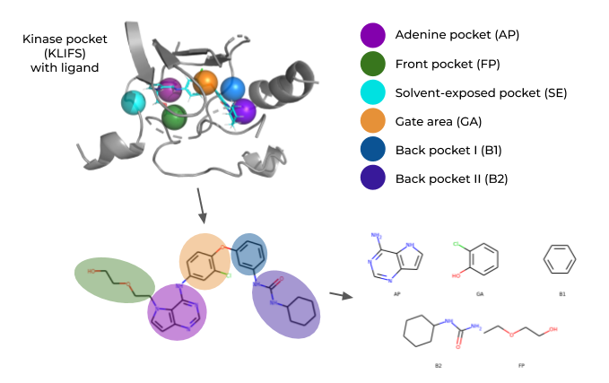

# KinFragLib: Kinase-focused fragment library



## Table of contents

- [Description](#description)
- [Repository content](#repository-content)
- [Quick start](#quick-start)
- [Contact](#contact)
- [License](#license)
- [Citation](#citation)

## Repository content

This repository holds 
1. the fragment library data and a link to the combinatorial library data,
2. a *quick start* notebook explaining how to load and use the fragment library, and 
3. notebooks covering the full analyses regarding the fragment and combinatorial libraries as described in 
the corresponding paper.

    data/
    notebooks/
    environment.yml
    
Please find detailed description of files in `data/` and `notebooks/` in the folders' `README` files.

## Description

**Exploring the kinase inhibitor space using subpocket-focused fragmentation and recombination**

Protein kinases play a crucial role in many cell signaling processes, 
making them one of the most important families of drug targets.
Fragment-based drug design has proven useful as one approach to develop novel kinase inhibitors. 
Usually, fragment-based methods follow a knowledge-driven approach, i.e., optimizing a focused set of fragments into 
molecular hits. 

We present here *KinFragLib*, a data-driven kinase-focused fragment library based on the structural kinome data 
retrieved from the [KLIFS](https://klifs.vu-compmedchem.nl) database.
Each kinase binding pocket (for DFG-in structures with non-covalent ligands) is automatically divided in *KinFragLib* 
into six subpockets, i.e. the adenine pocket (AP), front pocket (FP), solvent-exposed pocket (SE), gate area (GA) as 
well as back pocket 1 and 2 (B1 and B2), based on defined pocket-spanning residues.
Each co-crystallized ligand is fragmented using the BRICS algorithm and its fragments are assigned to the respective 
subpocket they occupy. 
Following this approach, a fragment library is created with respective subpocket pools. This fragment library enables 
an in-depth analysis of the chemical space of known kinase inhibitors, and can be used to enumerate recombined 
fragments in order to generate novel potential inhibitors.

## Quick start

1. Clone this repository.

    ```bash
    git clone https://github.com/volkamerlab/KinFragLib.git
    ```

2. Create the `kinfraglib` conda environment. 

    ```bash
    # Change to KinFragLib directory
    cd /path/to/KinFragLib   
 
    # Create and activate environment
    conda env create -f environment.yml
    conda activate kinfraglib

    # Link the conda environment to the Jupyter notebook
    python -m ipykernel install --user --name kinfraglib

    # Optionally, add TOC extension for Jupyter Lab
    jupyter labextension install @jupyterlab/toc
    
    # Install klifs_utils package
    pip install https://github.com/volkamerlab/klifs_utils/archive/master.tar.gz
    ```

3. Open the notebook `quick_start.ipynb` for an introduction on how to load and use the fragment library.

    ```bash
    # Change to KinFragLib directory (if you have not already)
    cd /path/to/KinFragLib
 
    # Start jupyter lab to explore the notebooks
    jupyter lab
    ```

## Contact

Please contact us if you have questions or suggestions.

* Open an issue on our GitHub repository: https://github.com/volkamerlab/KinFragLib/issues
* Or send us an email: andrea.volkamer@charite.de

We are looking forward to hearing from you!

## License

This resource is licensed under the [MIT](https://opensource.org/licenses/MIT) license, a permissive open source license.

## Citation

Sydow, D., Schmiel, P., Mortier, J., and Volkamer, A. KinFragLib: Exploring the Kinase Inhibitor Space Using Subpocket-Focused Fragmentation and Recombination. *In preparation.*
